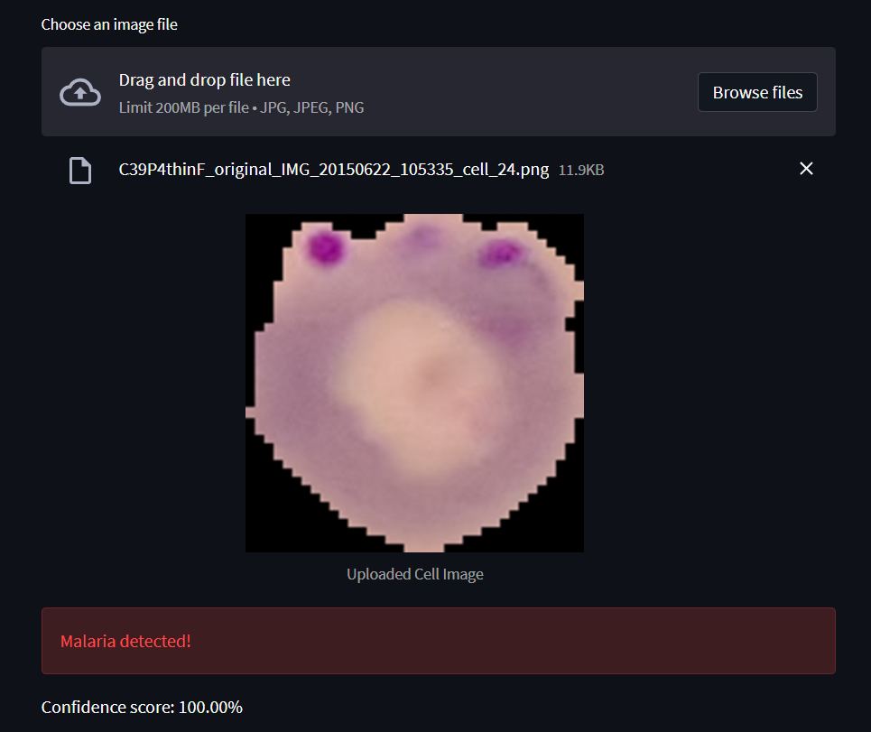

# Malaria Classification Research

## Overview
Malaria remains a significant global health concern, especially in areas with limited healthcare resources. Timely and accurate identification of malaria-infected cells in blood smear images is crucial for effective diagnosis and treatment. This research proposes an automated system for malaria cell identification using a combination of deep learning and traditional machine learning techniques.

## Methodology
The study employs Convolutional Neural Networks (CNNs) and Transfer Learning methods, including MobileNetV2, InceptionV3, DenseNet121, and Xception, to identify malaria cells in blood smear images. Techniques such as data augmentation are used to enhance training data and address model overfitting.

The research also explores the integration of deep learning-based feature extraction with traditional machine learning classifiers like Support Vector Machines (SVM), k-nearest Neighbors (k-NN), Random Forest, XGBoost, and AdaBoost. This hybrid approach aims to leverage the strengths of both deep learning and traditional machine learning to improve accuracy.

## Dataset
We used the publicly available Malaria Cell Images Dataset from the National Institutes of Health (NIH) on Kaggle. This dataset consists of a total of 27,558 cell images, with equal instances of parasitized and uninfected cells.

## Requirements
* Python 3.10.13
* TensorFlow 2.10.0
* Keras 2.10.0
* NumPy 1.26.4
* Matplotlib 3.8.0

## Usage
1. Download and install Anaconda or Miniconda.
2. Clone this repository
3. Install the requirements
4. Download the [Malaria Cell Images Dataset](https://www.kaggle.com/datasets/iarunava/cell-images-for-detecting-malaria/data) on Kaggle
5. Process the data
6. Train and Evaluate the model

## Result
Performance Result analysis of the deep learning approaches

Summary of Transfer Learning Models Performance with Different Algorithms

## Web Interface
https://malaria-detect.streamlit.app/

 

